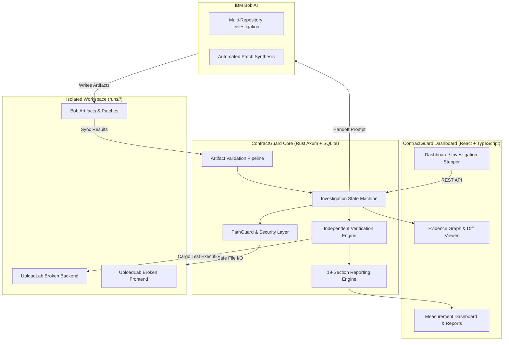

# TraceForge AI &mdash; ContractGuard

> **From Bug Report to Verified Fix &bull; IBM Bob 2.0 Hackathon Submission**
>
> Automated API contract drift diagnosis, IBM Bob-assisted root cause analysis, cryptographic human approval locking, and independent verification engine.

---

## Overview

Modern full-stack applications frequently suffer from **API contract drift**: subtle schema discrepancies between OpenAPI specifications, frontend form encoders, and backend streaming parsers. These defects often result in silent data omission without raising server errors or failing superficial unit tests.

**ContractGuard** solves this by orchestrating a rigorous, evidence-backed workflow:
1. **Isolated Workspace Setup**: Clones the targeted codebase into an isolated directory (`runs/<workspace_id>/`).
2. **Baseline Defect Reproduction**: Independently runs tests against the unpatched sample to capture and confirm failing regression baselines (e.g. 8 passed, 3 failed).
3. **IBM Bob Investigation**: Generates structured prompt templates guiding IBM Bob to inspect OpenAPI schemas, client code, server routes, and test suites, outputting machine-validated diagnostic artifacts (`diagnosis.json`, `fix_plan.md`).
4. **Cryptographic Human Approval**: Hashes the proposed fix plan with SHA-256 and requires explicit human approval before any implementation can occur.
5. **Fix Application & Verification**: Applies surgical code corrections in the isolated workspace and independently re-executes tests without mocks, proving the defects are resolved (11 passed, 0 failed).
6. **Contract Evidence Graph & 19-Section Reports**: Generates interactive causal graphs and exports standalone, print-friendly HTML and JSON reports.

---

## Architecture



---

## Quick Start

### Prerequisites
- **Rust**: `1.75+` with `cargo`
- **Node.js**: `20+` with `npm`
- **PowerShell** (Windows) or **Bash** (Linux/macOS)
- *(Optional)* **Docker** & **Docker Compose**

### 1. Automated Verification Script
Run the automated multi-stage verification script to verify all 4 layers end-to-end:

```powershell
# Windows PowerShell
.\scripts\verify.ps1
```

```bash
# Linux / macOS
chmod +x ./scripts/verify.sh
./scripts/verify.sh
```

This script verifies:
- `[1/4]` ContractGuard Backend (28 unit and integration tests)
- `[2/4]` ContractGuard Frontend (9 Vitest tests + production build)
- `[3/4]` UploadLab Backend Baseline (genuine BUG-002 reproduction: 8 pass, 3 fail)
- `[4/4]` UploadLab Frontend Baseline (genuine BUG-001 reproduction)

---

### 2. Local Development

#### Backend Setup (Rust Axum)
```powershell
# From devflow-ai/
cd backend
copy ..\.env.example .env

# Run database migrations and start server
cargo run
```
Backend runs at: `http://127.0.0.1:8080`
Health check: `http://127.0.0.1:8080/api/v1/health`

#### Frontend Setup (React Vite)
```powershell
# In a separate terminal
cd frontend
npm install
npm run dev
```
Frontend runs at: `http://localhost:5173`

---

### 3. Docker Deployment

ContractGuard includes a hardened multi-stage Docker build that compiles the React frontend, builds the Rust backend in release mode, and serves the frontend SPA directly through Axum on port `8080` using a non-root user.

```bash
# Build and run full interactive application
docker compose up --build

# Run public read-only demonstration mode (mutations blocked)
docker compose --profile demo up contractguard-demo
```

Access the containerized application at `http://localhost:8080`.

---

## Repository Structure

```
devflow-ai/
├── backend/                       # Rust Axum core application
│   ├── src/
│   │   ├── config.rs              # Environment-driven configuration
│   │   ├── errors.rs              # Sanitized application error hierarchy
│   │   ├── handlers/              # API endpoint route handlers
│   │   ├── models/                # Domain entities & state machine types
│   │   ├── repositories/          # SQLite persistence layer
│   │   ├── security/              # PathGuard traversal & command guard
│   │   └── services/              # Workspace, verification, artifacts, reporting
│   ├── tests/                     # Comprehensive integration test suites
│   └── migrations/                # Embedded SQLite SQL migrations
├── frontend/                      # React 18 + TypeScript + Vite SPA
│   ├── src/
│   │   ├── components/            # EvidenceGraph, DiffViewer, MetricsPanel
│   │   ├── pages/                 # InvestigationDetail, Reports, Dashboard
│   │   └── services/              # Type-safe Axios API client
│   └── tests/                     # Vitest component & API test suites
├── sample_project/                # UploadLab sample project
│   ├── openapi.yaml               # Authoritative API contract specification
│   ├── broken/                    # Immutable reference broken fixture
│   │   ├── backend/               # Rust Axum service with BUG-002
│   │   └── frontend/              # React application with BUG-001
├── bob/                           # IBM Bob workflow assets
│   ├── prompts/                   # investigate.md, implement.md, review.md
│   └── schemas/                   # JSON schemas for diagnosis & plan
├── scripts/                       # Verification scripts (verify.ps1, verify.sh)
├── Dockerfile                     # Multi-stage production container
├── docker-compose.yml             # Interactive & read-only demo configurations
└── README.md                      # System documentation
```

---

## Key Features & Hardening

### 1. Zero-Mock Independent Verification
- Tests are executed against real file systems and actual cargo test processes.
- Accelerated with shared compilation target caches (`CARGO_TARGET_DIR`) for sub-second test execution in isolated workspaces.
- Post-fix verification confirms 11 passed, 0 failed.

### 2. PathGuard Security
- All workspace operations enforce canonical path confinement.
- Rejects path traversal (`../`, `..\`), absolute paths, and symlink escapes.
- Test commands are restricted to whitelisted execution IDs (`CMD_RUST_BACKEND_TESTS`, `CMD_FRONTEND_TESTS`).

### 3. Cryptographic Human Approval
- Fix plans cannot be executed without human approval.
- Plans are hashed with SHA-256 (`plan_hash`). Any tampering invalidates approval.

### 4. 19-Section Comprehensive Reports
- Complies with Part 17 of the Hackathon specifications.
- Distinctly tags findings by origin:
  - `[Bob-Generated]` (findings, root causes, plan, summary)
  - `[System-Recorded]` (approvals, audit trail, workspace events)
  - `[Independently Executed]` (baseline & verification test executions)
  - `[Developer-Supplied]` (manual baseline benchmark measurements)
- Available via:
  - `GET /api/v1/investigations/:id/report` (JSON)
  - `GET /api/v1/investigations/:id/report.html` (Styled, print-friendly standalone HTML)
  - `GET /api/v1/investigations/:id/report.json` (Direct JSON schema export)

### 5. Productivity Measurement Dashboard
- Compares automated triage against developer manual baseline benchmarks.
- Computes active minutes saved and percentage time reduction (e.g. 70–85% time savings).
- Interactive benchmark recording form (`POST /api/v1/investigations/:id/manual-baseline`).

### 6. Public Demonstration Mode
- When `DEMO_MODE=true` is set, all mutation endpoints (`POST /investigations`, `POST /baseline`, `POST /approval`, `POST /verification`) return `403 Forbidden`.
- Read-only diagnostics, reports, and evidence graphs remain fully accessible.

---

## API Reference

| Method | Endpoint | Description |
| :--- | :--- | :--- |
| `GET` | `/api/v1/health` | Service health status and version |
| `GET` | `/api/v1/projects` | List registered target projects |
| `POST` | `/api/v1/investigations` | Create new investigation & isolated workspace |
| `GET` | `/api/v1/investigations/:id` | Get investigation status and details |
| `POST` | `/api/v1/investigations/:id/baseline` | Run baseline reproduction tests |
| `GET` | `/api/v1/investigations/:id/bob/investigation-prompt` | Get generated Bob investigation prompt |
| `POST` | `/api/v1/investigations/:id/artifacts/sync` | Sync and validate Bob artifacts |
| `GET` | `/api/v1/investigations/:id/findings` | List parsed findings & evidence |
| `GET` | `/api/v1/investigations/:id/plan` | Get correction plan & cryptographic hash |
| `POST` | `/api/v1/investigations/:id/approval` | Submit human approval decision |
| `GET` | `/api/v1/investigations/:id/bob/implementation-prompt` | Get implementation prompt (approval-gated) |
| `POST` | `/api/v1/investigations/:id/verification` | Execute independent post-fix verification |
| `GET` | `/api/v1/investigations/:id/diff` | Get actual unified code diff of modifications |
| `GET` | `/api/v1/investigations/:id/report` | Complete 19-section investigation report |
| `GET` | `/api/v1/investigations/:id/report.html` | Standalone print-friendly HTML report |
| `GET` | `/api/v1/investigations/:id/report.json` | JSON export of investigation report |
| `GET` | `/api/v1/investigations/:id/metrics` | Productivity metrics & manual comparison |
| `POST` | `/api/v1/investigations/:id/manual-baseline` | Record manual developer benchmark |

---

## License

Developed for the **IBM Bob 2.0 Hackathon (September 2026)**.
Licensed under the Apache License 2.0.
